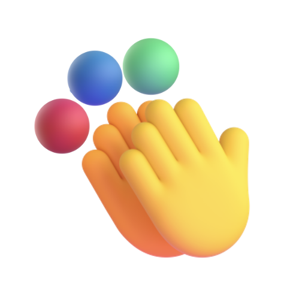
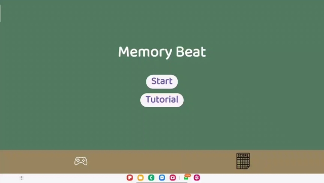
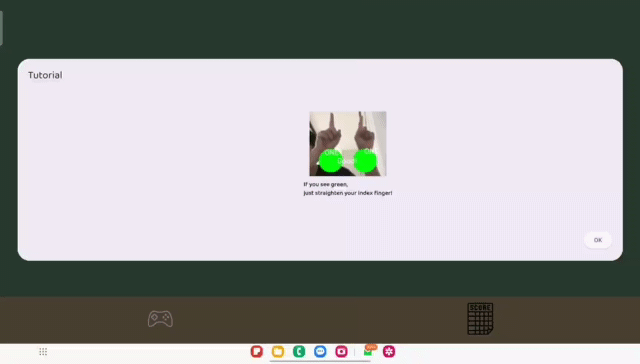
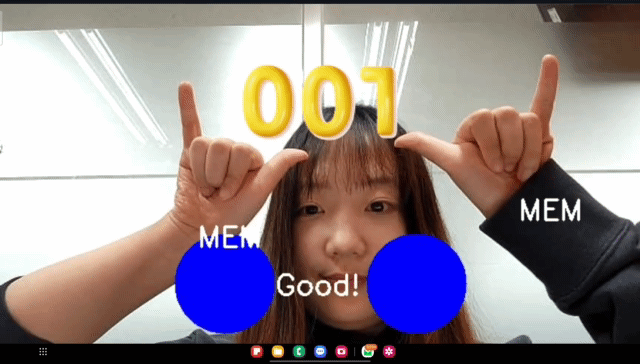
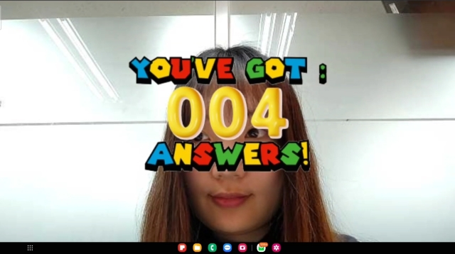
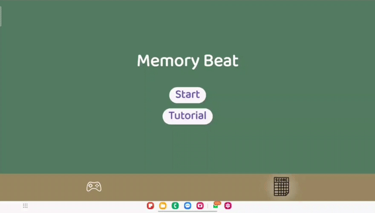
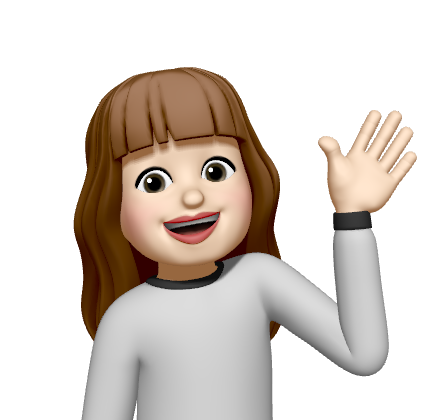
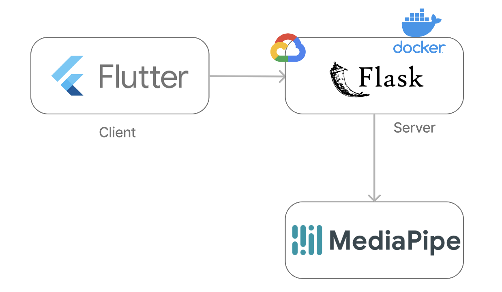

# GDSC Project Memory Beat!

- [backend link](https://github.com/GDSC-MemoryBeat/Memory-BE)

## 🖐️ Preventing Dementia With Hand Exercise

> Look at the colors and match the hand gestures to get points

- Matching colors and hand gestures to help increase memory
- It analyzes the score and shows how much the improvement is
  
# 📃 App Menual
## Main window

## Tutorial

## Game

## Game ends

## Score

# 👨‍👦‍👦 Team Members

|              [Yuna Park](https://github.com/realyuna)              |            [Sumin Bae](https://github.com/sumsum07)             |            [Yejun Han](https://github.com/Cat-yejun)            |
|:------------------------------------------------------------:|:------------------------------------------------------------:|:------------------------------------------------------------:|
|  |  |  |
|                       Frontend                    |                      Backend                     |                              AI                              |

# 🛠️  TECH Stack

# 📱 How to execute App
>only available in android
